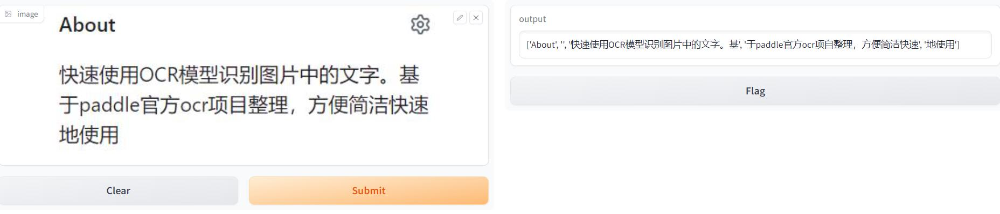

## 快速使用OCR模型检测图片中的文字
>基于paddle官方项目整理：https://github.com/PaddlePaddle/FastDeploy/tree/develop/examples/vision/ocr/PP-OCR/cpu-gpu/python  
>本项目将paddle官方FastDeploy中PPOCRv3进行了整理，方便快速简洁地使用  
>rec_label.txt中是识别的字符标签，实际应用中可根据情况替换空格等一些无用符号为空字符  
### 1，环境
>```
>pip install fastdeploy-python/fastdeploy-gpu-python -f https://www.paddlepaddle.org.cn/whl/fastdeploy.html
>pip install opencv-python -i https://pypi.tuna.tsinghua.edu.cn/simple
>```
### 2，image
>image文件夹中存放待检测文字的图片
### 3，predict.py
>使用模型检测图片中的文字
### 4，gradio_start.py
>用gradio将程序包装成一个可视化的界面，可以在网页可视化的展示
### 5，flask_start.py
>用flask将程序包装成一个服务，并在服务器上启动
### 6，flask_request.py
>以post请求传输数据调用服务
### 7，gunicorn_config.py
>用gunicorn多进程启动flask服务：gunicorn -c gunicorn_config.py flask_start:app
***
